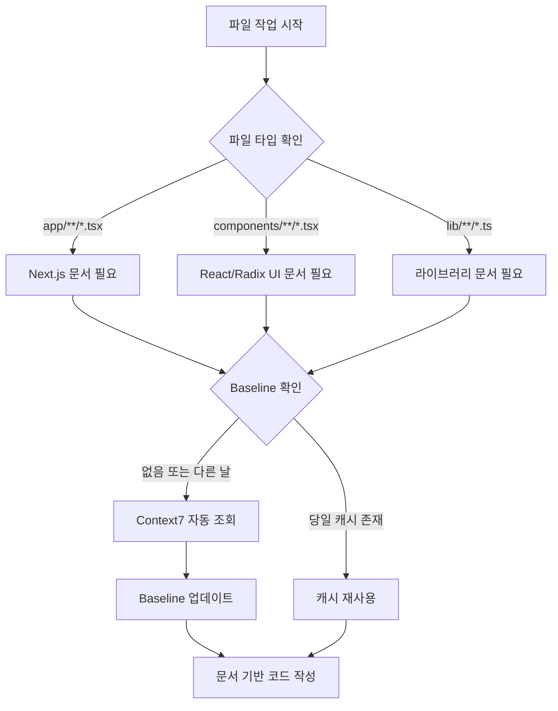

# Context7 자동 조회 가이드

이 문서는 pomobox 프로젝트에서 Context7을 자동으로 활용하는 방법을 설명합니다.

## 📋 개요

- **정책**: 작업 시작 시 자동으로 Context7 조회 (옵션 1: 적극적)
- **할당량**: 200/day 적극 활용 (일일 15-30회 예상)
- **캐시**: 당일은 재사용, 다음 날 자동 재조회
- **목표**: 항상 최신 라이브러리 문서 기반으로 작업

## 🗂️ 파일 타입별 자동 조회 규칙

### 1. App Router 파일
**패턴**: `app/**/*.tsx`, `app/**/*.ts`
**라이브러리**: `/vercel/next.js`

**자동 조회 Topic 예시**:
- `app/layout.tsx` 작업 시 → "app router metadata", "layout component"
- `app/page.tsx` 작업 시 → "server components", "page props"
- `app/api/route.ts` 작업 시 → "route handlers", "next response"

### 2. Components
**패턴**: `components/**/*.tsx`
**라이브러리**: React, Radix UI

**자동 조회 Topic 예시**:
- `components/settings-dialog.tsx` → "/radix-ui/primitives dialog focus-trap"
- `components/ui/button.tsx` → "react hooks", "component patterns"
- `components/pomodoro-timer.tsx` → "react hooks useState useEffect"

### 3. Library/Utils
**패턴**: `lib/**/*.ts`
**라이브러리**: 사용 중인 라이브러리

**자동 조회 Topic 예시**:
- `lib/validation.ts` → "/colinhacks/zod schema validation"
- `lib/date-utils.ts` → "/date-fns date formatting"
- `lib/api-client.ts` → "fetch API", "error handling"

### 4. Tests
**패턴**: `tests/**/*.ts`, `tests/**/*.spec.ts`
**라이브러리**: Playwright

**자동 조회 Topic 예시**:
- `tests/e2e/timer.spec.ts` → "/microsoft/playwright locators assertions"
- `tests/e2e/settings.spec.ts` → "playwright dialog testing"

## 🔄 자동 조회 흐름



## 📝 Baseline 스키마

각 조회 결과는 `docs/context7-baseline.json`에 다음 형식으로 저장:

```json
{
  "topicName": "nextjs-server-actions-2025-12-24",
  "context7CompatibleLibraryID": "/vercel/next.js",
  "topic": "server actions form validation",
  "pageRange": "1-2",
  "retrievedAt": "2025-12-24T00:00:00Z",
  "keyAPIs": [
    "useFormState from react-dom",
    "server action async function",
    "redirect from next/navigation"
  ],
  "constraints": [
    "Server Actions must be async",
    "FormData is the primary input",
    "redirect cannot be called inside try/catch"
  ],
  "appliesToFiles": [
    "app/actions/*.ts",
    "components/forms/*.tsx"
  ]
}
```

## 🎯 캐시 갱신 정책

### 당일 재사용
```
작업: components/timer.tsx 수정 (2025-12-24 10:00)
→ Baseline 확인: "react-hooks-timer" (retrievedAt: 2025-12-24)
→ 같은 날 → 캐시 재사용 (Context7 호출 안 함)
```

### 다음 날 자동 재조회
```
작업: components/timer.tsx 수정 (2025-12-25 09:00)
→ Baseline 확인: "react-hooks-timer" (retrievedAt: 2025-12-24)
→ 다른 날 → Context7 자동 조회
→ Baseline 업데이트 (retrievedAt: 2025-12-25)
```

## 📊 할당량 관리

### 예상 일일 사용량
- **파일 수정 작업**: 5-10회
- **새 파일 생성**: 3-5회
- **리팩토링/버그 수정**: 7-15회
- **총합**: 15-30회 (할당량의 7.5-15%)

### 할당량 부족 시
- 당일 캐시만 사용 (재조회 중단)
- 다음 날 자정에 할당량 갱신
- 중요한 작업 우선순위 조정

## 🚀 사용 예시

### 예시 1: Settings Dialog 접근성 개선
```
작업: components/settings-dialog.tsx 수정
목표: 키보드 포커스 트랩 추가

1. 파일 열기 → components/**/*.tsx 패턴 감지
2. Baseline 확인: "radix-dialog-focus-trap" (2025-12-23)
3. 다른 날 → Context7 자동 조회
4. Topic: "/radix-ui/primitives dialog focus-trap keyboard"
5. Baseline 업데이트 (2025-12-24)
6. 최신 Dialog API 문서로 코드 작성:
   - DialogContent의 onCloseAutoFocus prop
   - Radix의 내장 focus-trap 활용
   - ESC 키 처리
```

### 예시 2: Server Action 추가
```
작업: app/actions/timer.ts 생성
목표: 타이머 세션 저장 API

1. 파일 생성 → app/**/*.ts 패턴 감지
2. Baseline 확인: "nextjs-server-actions" (없음)
3. Context7 자동 조회
4. Topic: "/vercel/next.js server actions database"
5. Baseline 저장 (2025-12-24)
6. 문서 기반 Server Action 작성:
   - 'use server' directive
   - async function
   - revalidatePath for cache
```

## ⚠️ 주의사항

1. **같은 topic은 하루 1회만 조회**: 중복 방지
2. **retrievedAt 날짜 기준**: ISO 8601 형식, 날짜만 비교
3. **Baseline은 git 추적**: 팀원과 캐시 공유
4. **할당량 모니터링**: 사용량이 150회 초과 시 경고

## 🔗 관련 문서

- [CLAUDE.md Section 4.2](../CLAUDE.md#42-context7-free-200day-적극-활용--자동-조회-정책)
- [.claude/commands/docs.md](../.claude/commands/docs.md)
- [Context7 Baseline](./context7-baseline.json)

---

**마지막 업데이트**: 2025-12-24
**정책 버전**: 옵션 1 (적극적 자동 조회)
